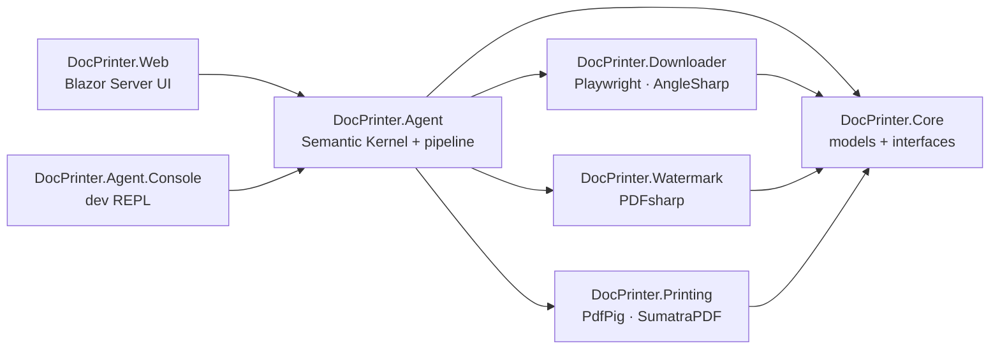

# Document Print Automation

A .NET 9 app that turns a multi-step document chore into one chat message: say which past exam paper you want, and it downloads the PDF, removes the watermark overlay and prints it double-sided with a guided paper flip.

> 🛠️ Personal project (2026). I built it to automate the printing side of my own exam prep, and as a hands-on project for Semantic Kernel tool-calling agents.

[](https://github.com/iulvimercan/document-printer/actions/workflows/ci.yml)


<!-- TODO: add a screenshot of the Blazor chat with the pipeline status and the flip panel (no source-site branding or watermarked pages in the image) -->

## ✨ Features
- **Chat to print.** Ask for a document by year and session in plain language. The assistant asks for anything that's missing and turns down unsupported requests.
- **Automated download.** Playwright drives a headless browser through the configured source site and saves the PDF.
- **Watermark removal.** The diagonal text overlay is removed straight from the PDF's structure, and the page content stays untouched.
- **Section picking.** For sectioned documents, the section start pages are detected from the page headers, so you can print only the sections you need.
- **Guided duplex on any printer.** Even pages print first, the app pauses and asks you to flip the stack, and then the odd pages print.
- **Live status.** The web UI shows each pipeline stage (download → clean → print) while it runs.

## 🏗️ Architecture


Dependencies only point inward. `Core` holds the models and interfaces (`IDocumentSource`, `IWatermarkRemover`, `ISectionDetector`, `IDuplexPrinter`) and references nothing. Each library implements one interface and registers itself through an `Add…()` extension method. `Agent` wires them into a `DocumentPipeline` and exposes two Semantic Kernel tools: `PrepareDocument` and `PrintDocument`. Both hosts (the Blazor app and the console REPL) only call `AddAgent()` and supply their own flip prompt. The Blazor host scopes the agent per circuit, so concurrent users don't share a conversation.

| Project | Responsibility |
| --- | --- |
| `DocPrinter.Core` | Models and interfaces only, no dependencies |
| `DocPrinter.Downloader` | Browser automation: navigate the source site, pick the right link, download |
| `DocPrinter.Watermark` | Detect and empty the watermark overlay (PDFsharp) |
| `DocPrinter.Printing` | Section detection (PdfPig), duplex page planning, silent printing through SumatraPDF |
| `DocPrinter.Agent` | Semantic Kernel chat agent, tool plugin and pipeline orchestration |
| `DocPrinter.Agent.Console` | Console REPL for driving the agent end to end |
| `DocPrinter.Web` | Blazor Server chat UI, live status and the flip-confirmation panel |

## 🧰 Tech stack
**App:** .NET 9 · Blazor Server · Semantic Kernel (Azure OpenAI chat completion; the Ollama connector is referenced for local models) · **Automation:** Playwright · AngleSharp · **PDF:** PDFsharp · PdfPig · SumatraPDF · **Testing:** xUnit · GitHub Actions

## 🚀 Getting started
Prerequisites: Windows, the .NET 9 SDK, an Azure OpenAI deployment, and [SumatraPDF](https://www.sumatrapdfreader.org/) (portable build).

1. **SumatraPDF.** It's GPLv3, so it isn't bundled. Put `SumatraPDF.exe` at `tools/SumatraPDF/SumatraPDF.exe`, and the build copies it next to the app. You can also point `Printing:SumatraPath` at an existing install. If neither is set, printing throws `SumatraPdfNotFoundException`.
2. **Configuration.** The source site and model settings aren't hard-coded. Set them with [.NET User Secrets](https://learn.microsoft.com/aspnet/core/security/app-secrets). The Web and console projects share one secret store.
   ```powershell
   dotnet user-secrets set "Downloader:EntryUrl"     "<source entry page URL>"        --project src/DocPrinter.Web
   dotnet user-secrets set "Downloader:DocumentHost" "<document host, optional>"      --project src/DocPrinter.Web
   dotnet user-secrets set "Agent:ModelId"           "<deployment name>"              --project src/DocPrinter.Web
   dotnet user-secrets set "Agent:Endpoint"          "<Azure OpenAI endpoint>"        --project src/DocPrinter.Web
   dotnet user-secrets set "Agent:Key"               "<API key>"                      --project src/DocPrinter.Web
   ```
   `EntryUrl` is the page the browser starts from. `DocumentHost` helps recognize download links, and without it links are matched by their `.pdf` suffix. `Printing:PrinterName` picks a printer other than the default.
3. **Run.**
   ```powershell
   dotnet run --project src/DocPrinter.Web              # Blazor web app
   dotnet run --project src/DocPrinter.Agent.Console    # or chat in the terminal
   ```
   The Playwright Chromium browser installs itself on the first download, so the first run pauses for a moment.

## 🧪 Tests
```powershell
dotnet test --filter "Category!=Live"
```
The unit tests run offline, against synthetic PDFs and saved HTML fixtures. They cover link selection, page parsing, watermark detection and removal, section detection, duplex page planning, the request parsers, the agent plugin, pipeline progress and the Blazor flip prompt. CI runs them on every push.

Tests tagged `Category=Live` hit the real site, model, sample PDF and printer. They're no-ops unless `DOC_LIVE_TESTS=1` is set.

## 💡 Key decisions & what I learned
- **The LLM only decides *what* to print.** The model works out the year, session and sections, then calls `PrepareDocument` / `PrintDocument`. Link selection (`DocumentLinkSelector`), download, PDF editing and printing are deterministic C#. I chose this over letting the agent browse and click because it keeps every step unit-testable and makes a wrong document a clear error instead of a quiet hallucination. The cost is keeping the link rules updated when the site layout changes.
- **The watermark is found from PDF structure, not with a vision model.** `WatermarkDetector` looks for Acrobat's `/PieceInfo … /Watermark` tag and for the rotated-transform form that draws the diagonal stamp, then empties only that form's content stream. It's fast, offline and doesn't depend on a particular year or page count. The trade-off is that it only handles this kind of text-overlay watermark.
- **Guided manual flip instead of printer duplex.** Many home printers can't print double-sided. `DuplexPlan` works out the even and odd passes (it drops the unneeded instructions page unless keeping it makes the sheet count come out even, and can reverse the second pass), and the pipeline waits on an `IFlipPrompt` in between. The console asks in the terminal and the web app shows a confirm panel. The planning is pure, so page-order bugs get caught in tests, not on paper.
- **Inward-only layering with interfaces in `Core`.** Each capability is its own project behind a `Core` interface. That let me build and test the downloader, watermark remover and printer one by one before any AI was involved, and swap in test doubles for the agent tests.

## 📜 Project history
The repository was published as a single snapshot of a project I developed locally, so the commit history doesn't show the step-by-step development.

<!-- TODO: add a LinkedIn link in a "📬 Contact" section -->

## 📄 License
Released under the [MIT License](LICENSE).
